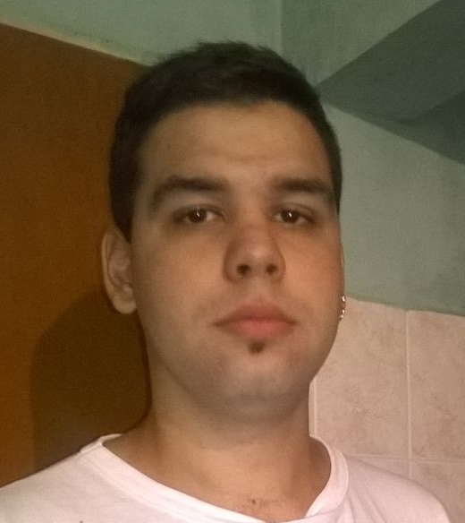

# Presentación

## Matias Ezequiel Giraudo

Tengo 26 años, soy estudiante de la Licenciatura en Programación. 
Vivo en Quilmes y trabajo como programador en una empresa en Capital.
Espero aprender cada vez mas y me encanta programar.

- [ ] **Mirá la presentación de tus compas**. Una vez que terminaste, andá al [Github del curso](https://github.com/obj1unq) y mirá las presentaciones de tus compas. Haceles comentarios en la parte de _Issues_, despus volvé y respondé los issues de tu presentación.

